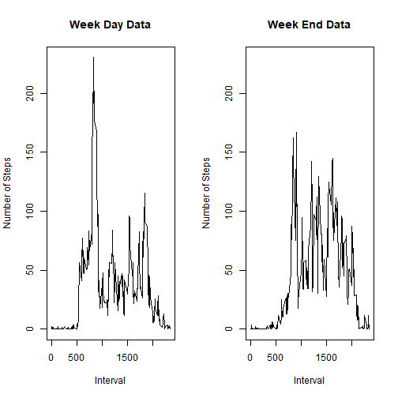

Title
=========================================================================

Mean Steps taken in a day


```r
#Load the data table package
library(data.table)

activity <- read.csv("activity.csv")
#Converting the data frame into a datatable
activity <- data.table(activity)
activity$date <- as.Date(activity$date)

#Calculating and plotting the total number of steps in a day
totalActivity <- activity[, list(total= sum(steps, na.rm = T)), by=date]
hist(totalActivity$total, col = "magenta", main= "Total Number of steps in a day", xlab="Total Steps")
```


```r
#Calculating and plotting the Mean number of steps in a day
MeanActivity <- activity[, list(Mean= mean(steps, na.rm = T)), by=date]
hist(MeanActivity$Mean, main= "Average number of Steps in a day", col="green", xlab="Mean Steps")
```


```r
#Calculating and plotting the Median of the total steps in a day
MedianActivity <- activity[, list(Median= median(steps, na.rm = T)), by=date]
hist(MedianActivity$Median, main= "Median of number of Steps in a day", col="blue", xlab="Median")
```


Average daily activity pattern(TimeSeries Analysis)


```r
MeanAc <- activity[, list(Mean= mean(steps, na.rm = T)), by=interval]
plot.ts(MeanAc$interval, MeanAc$Mean, type="l", pch=18, col="steel blue", xlab="5 Minute Interval", ylab="Mean steps across all the days", main="TimeSeries Analysis")
```


```r
MaxSteps <- max(MeanAc$Mean, na.rm=T)
rowNum <- which(MeanAc$Mean == MaxSteps)
MaxInterval <- MeanAc[rowNum,1]
```

The interval in which max number of steps is taken 835

Missing values in the DataSet

```r
CNa <-  sum(is.na(activity))
```

The number of missing values in the data set is 2304


```r
ac <- activity
# Replacing missing values with mean of that interval data
for( i in 1:17568  )
{ 
  
  if(is.na(ac$steps[i]))
  
    {
     j <- ac$interval[i]
     ac$steps[i] <-  MeanAc$Mean[MeanAc$interval==j ]
  
    }
}

totalAc <- ac[, list(total= sum(steps, na.rm = T)), by=date]

hist(totalAc$total, col=  "magenta", main= "Total Number of Steps  after imputing the data", xlab = "Total Steps")
```


```r
#Calculating and plotting the Mean number of steps in a day
MeanAc <- ac[, list(Mean= mean(steps, na.rm = T)), by=date]
hist(MeanAc$Mean, main= "Average number of Steps in a day", col="green", xlab="Mean Steps")
```


```r
#Calculating and plotting the Median of the total steps in a day
MedianAc <- ac[, list(Median= median(steps, na.rm = T)), by=date]
hist(MedianAc$Median, main= "Median of number of Steps in a day", col="blue", xlab="Median")
```


Mean of the total number steps in a day doesn't effect much but the median does


```r
tempActivity <- ac
tempActivity$day <- weekdays(tempActivity$date) 
weekdy <- c( "Monday", "Tuesday", "Wednesday" ,"Thursday", "Friday")
weeken <- c("Saturday", "Sunday")
tempActivity$day = ifelse( tempActivity$day %in% weekdy, "WeekDay", "WeekEnd" )

MeanByWeekDay <- subset(tempActivity, day== "WeekDay")
MeanByWeekDay <- MeanByWeekDay[, list(Mean= mean(steps, na.rm = T)), by=interval]

MeanByWeekEnd <- subset(tempActivity, day== "WeekEnd")
MeanByWeekEnd <- MeanByWeekEnd[, list(Mean= mean(steps, na.rm = T)), by=interval]

rng <- range(MeanByWeekDay$Mean, MeanByWeekEnd$Mean)
par(mfrow= c(1, 2))
plot(MeanByWeekDay$interval, MeanByWeekDay$Mean, type="l", main="Week Day Data", ylim = rng, ylab="Number of Steps", xlab = "Interval" )
plot(MeanByWeekEnd$interval, MeanByWeekEnd$Mean, type="l", main="Week End Data", ylim= rng, ylab = "Number of Steps", xlab= "Interval")
```




From the above two graphs we can notice that the activity on Week Day is compartively more than that on a Week End


